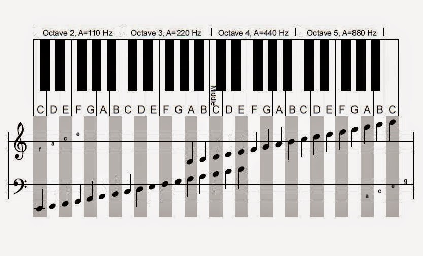

# Google Foobar Invitation

Some (interesting) problems from the invitation I received from Google's selection program **Google Foobar**.

Final decrypted message:
```
{
    'success' : 'great', 
    'colleague' : 'esteemed', 
    'efforts' : 'incredible', 
    'achievement' : 'unlocked', 
    'rabbits' : 'safe', 
    'foo' : 'win!'
}
```

<br/>

## Problem 1: Bringing a Gun to a Trainer Fight

Write a function solution(dimensions, your_position, trainer_position, distance) that gives an array of 2 integers of the width and height of the room, an array of 2 integers of your x and y coordinates in the room, an array of 2 integers of the trainer's x and y coordinates in the room, and returns an integer of the number of distinct directions that you can fire to hit the elite trainer, given the maximum distance that the beam can travel.

The room has integer dimensions [1 < x_dim <= 1250, 1 < y_dim <= 1250]. You and the elite trainer are both positioned on the integer lattice at different distinct positions (x, y) inside the room such that [0 < x < x_dim, 0 < y < y_dim]. Finally, the maximum distance that the beam can travel before becoming harmless will be given as an integer 1 < distance <= 10000.

**Test cases**

```
Input: ([3,2], [1,1], [2,1], 4)
Output: 7
```
```
Input: ([300,275], [150,150], [185,100], 500)
Output: 9
```

**Solution:**

A simulation problem. Key observation is to work with quadrant reflections instead trying to simulate all posible directions by angle. **Simulation: O(n^2)** 

1. Reflect the grid over the first (positive) quadrant. Other 3 quadrants are calculated multipliying by -1 the corresponding axis.
2. Count every DISTINCT line between YOU and (reflected) TRAINERS where length <= Distance and no "obstacles" (yourself or another trainer point previously counted) in the middle.

<br/>



<br/>

## Problem 2: Running with Bunnies

You and the bunny workers need to get out of this collapsing death trap of a space station -- and fast! Unfortunately, some of the bunnies have been weakened by their long work shifts and can't run very fast. Their friends are trying to help them, but this escape would go a lot faster if you also pitched in. The defensive bulkhead doors have begun to close, and if you don't make it through in time, you'll be trapped! You need to grab as many bunnies as you can and get through the bulkheads before they close. 

The time it takes to move from your starting point to all of the bunnies and to the bulkhead will be given to you in a square matrix of integers. Each row will tell you the time it takes to get to the start, first bunny, second bunny, ..., last bunny, and the bulkhead in that order. The order of the rows follows the same pattern (start, each bunny, bulkhead). The bunnies can jump into your arms, so picking them up is instantaneous, and arriving at the bulkhead at the same time as it seals still allows for a successful, if dramatic, escape. (Don't worry, any bunnies you don't pick up will be able to escape with you since they no longer have to carry the ones you did pick up.) You can revisit different spots if you wish, and moving to the bulkhead doesn't mean you have to immediately leave -- you can move to and from the bulkhead to pick up additional bunnies if time permits.

In addition to spending time traveling between bunnies, some paths interact with the space station's security checkpoints and add time back to the clock. Adding time to the clock will delay the closing of the bulkhead doors, and if the time goes back up to 0 or a positive number after the doors have already closed, it triggers the bulkhead to reopen. Therefore, it might be possible to walk in a circle and keep gaining time: that is, each time a path is traversed, the same amount of time is used or added.

Write a function of the form solution(times, time_limit) to calculate the most bunnies you can pick up and which bunnies they are, while still escaping through the bulkhead before the doors close for good. If there are multiple sets of bunnies of the same size, return the set of bunnies with the lowest worker IDs (as indexes) in sorted order. The bunnies are represented as a sorted list by worker ID, with the first bunny being 0. There are at most 5 bunnies, and time_limit is a non-negative integer that is at most 999.

**Test cases**

```
Input: ({{0, 1, 1, 1, 1}, {1, 0, 1, 1, 1}, {1, 1, 0, 1, 1}, {1, 1, 1, 0, 1}, {1, 1, 1, 1, 0}}, 3)
Output: [0, 1]
```
```
Input: ({{0, 2, 2, 2, -1}, {9, 0, 2, 2, -1}, {9, 3, 0, 2, -1}, {9, 3, 2, 0, -1}, {9, 3, 2, 2, 0}}, 1)
Output: [1, 2] 
```

**Solution:**

The problem has some similarities with the TSP (NP-Hard) problem. Using a dp approach generating all possible subsets using a bitmask. **Bitmask + DP: O(2^n*n^2)**

1. Use Floyd-Warshall to get the optimal distances and detect if exists a negative cylce in the graph.
2. dp[mask][v] : best way to traverse the 'mask' subset of nodes ending at node v

<br/>

# Problem 3: Disorderly Escape

Write a function solution(w, h, s) that takes 3 integers and returns the number of unique, non-equivalent configurations that can be found on a star grid w blocks wide and h blocks tall where each celestial body has s possible states. Equivalency is defined as above: any two star grids with each celestial body in the same state where the actual order of the rows and columns do not matter (and can thus be freely swapped around). Star grid standardization means that the width and height of the grid will always be between 1 and 12, inclusive. And while there are a variety of celestial bodies in each grid, the number of states of those bodies is between 2 and 20, inclusive. The solution can be over 20 digits long, so return it as a decimal string. The intermediate values can also be large, so you will likely need to use at least 64-bit integers.

**Test cases**

```
Input: (2, 2, 2)
Output: 7
```
```
Input: (2, 3, 4)
Output: 430
```

**Solution:**

Difficult one!!! Strong foundations of Math (Group Theory, Combinatorics) needed. I ended solving it with 'a bit' help (digging on the web) but I learned some interesting concepts.

Solved applying group theory concepts: **Burnside's Lemma / Polya Enumeration Theorem**

**Ref:**

https://medium.com/@chris.bell_/google-foobar-as-a-non-developer-level-5-a3acbf3d962b

https://stackoverflow.com/questions/42655813/algorithm-to-find-unique-non-equivalent-configurations-given-the-height-the-wi

https://codereview.stackexchange.com/questions/263421/applied-solution-based-on-polya-enumeration-theorem